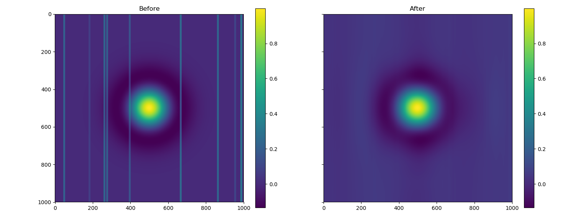

# Remove stripes

Remove stripes from images with a combined wavelet/FFT approach as suggested
by [Beat Münch, Pavel Trtik, Federica Marone, and Marco Stampanoni](https://www.osapublishing.org/oe/fulltext.cfm?uri=oe-17-10-8567&id=179485#ref11)

## Usage

Before applying the wavelet/FFT filtering method it is recommended to fill masked
values in the image. This can be done with one of the two command included
in this package: `fill-mask-expand` or `fill-mask-nn`.

The filled image can then be destriped:

    rmstripes filled_image.tif -o nostripes.tif

## Preview

A before/after comparison of the `rmstripes` command:

